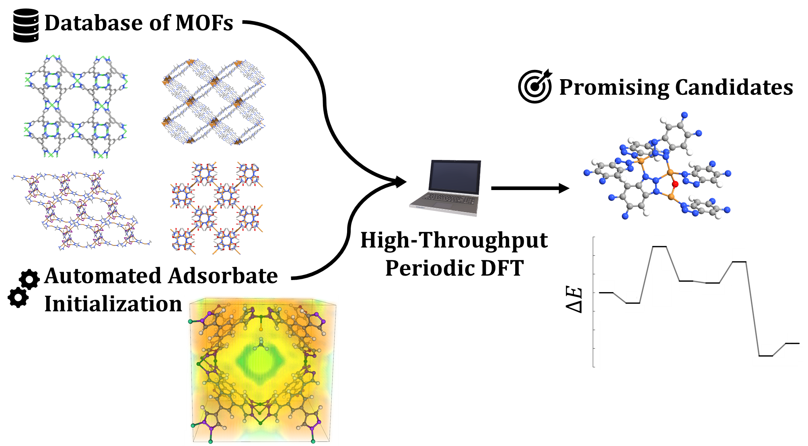
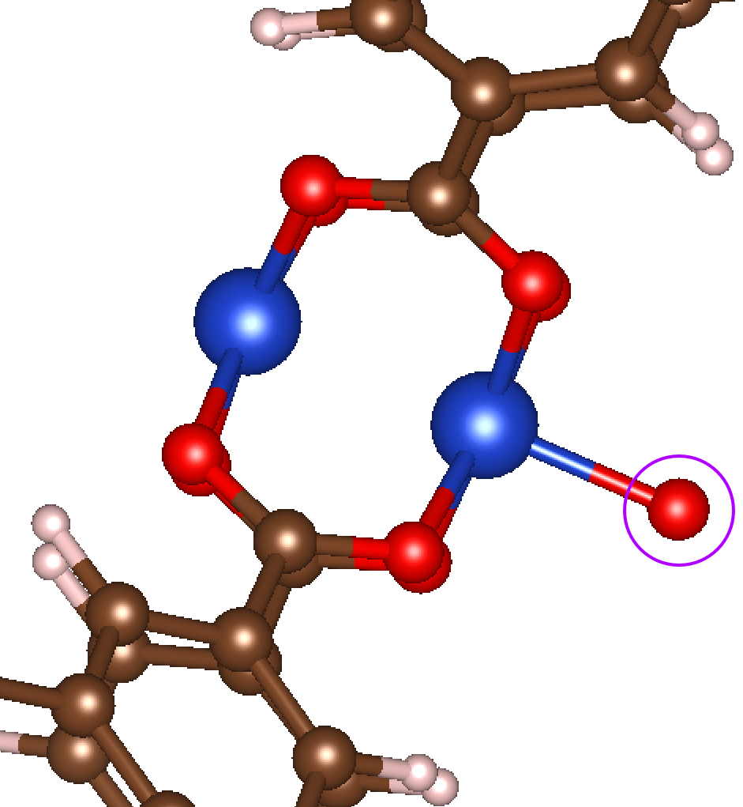
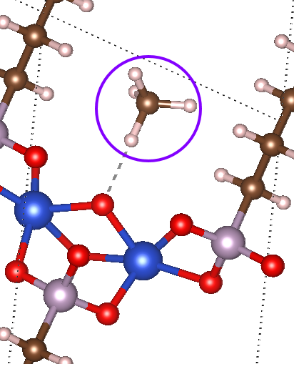

# MOF Adsorbate Initializer (MAI)
Python code to initialize the position of adsorbates in MOFs for high-throughput DFT screening workflows. Relevant details for the code can be found in the following manuscript (once published):

A.S. Rosen, J.M. Notestein, R.Q. Snurr. "Identifying Promising Metal-Organic Frameworks for Heterogeneous Catalysis via High-Throughput Periodic Density Functional Theory." In preparation. 



## What is MAI?
High-throughput computational catalysis typically involves the calculation of many different adsorption energies. MAI is a tool meant to automate the process of constructing reasonable initial guesses for adsorbates in MOFs for the purposes of DFT screening workflows. For implementing a high-throughput DFT workflow, refer to our [PyMOFScreen](https://github.com/arosen93/mof_screen) code.

## Ready-to-Run Examples
To get started, sample scripts are provided in the `examples` base directory of MAI and include the following:
1. `add_O.py`. Adds an O adsorbate to `ANUGIA.cif` given a pre-determined Cu site.
2. `add_O_OMS_zeo.py`. Adds an O adsorbate to `ANUGIA.cif` using the OMS detection algorithm in Zeo++.
3. `add_O_OMS_omd.py`. Adds an O adsorbate to `ANUGIA.cif` using the OMS detectiong algorithm in [Open_Metal_Detector.py](https://github.com/emmhald/open_metal_detector).
4. `add_CH4_PEG_ASCII.py`. Adds a CH4 adsorbate to a terminal Cu-oxo site in `AHOKIR01-O.cif` using an ASCII-based PEG.
5. `add_CH4_PEG_cube.py`. Adds a CH4 adsorbate to a terminal Cu-oxo site in `ANUGIA_clean_min_O.cif` using a cube-based PEG (`todo`).

## The Adsorbate Constructor
The main tool to initialize adsorbate positions is the `adsorbate_constructor` class:

```python
class adsorbate_constructor():
	"""
	This class constructs an ASE atoms object with an adsorbate
	"""
	def __init__(self,ads_species,bond_dist,site_idx=None,site_species=None,
		r_cut=2.5,sum_tol=0.5,rmse_tol=0.25,overlap_tol=0.75):
		"""
		Initialized variables

		Args:
			ads_species (string): string of atomic element for adsorbate
			(e.g. 'O')

			bond_dist (float): distance between adsorbate and surface atom. If
			used with get_adsorbate_grid, it represents the maximum distance

			site_idx (int): ASE index for the adsorption site
			
			site_species (string): if site_idx is not specified, can specify
			the site_species as a string of the atomic element for the adsorption
			site (autoamtically picks the ASE index for the last atom of type
			site_species in the Atoms object)
			
			r_cut (float): cutoff distance for calculating nearby atoms when
			ranking adsorption sites
			
			sum_tol (float): threshold to determine planarity. when the sum
			of the Euclidean distance vectors of coordinating atoms is less
			than sum_tol, planarity is assumed
			
			rmse_tol (float): second threshold to determine planarity. when the 
			root mean square error of the best-fit plane is less than rmse_tol,
			planarity is assumed
			
			overlap_tol (float): distance below which atoms are assumed to be
			overlapping
		"""
```
Once the `adsorbate_constructor` is instanced, one of three routines can be called: `get_adsorbate_pm`, `get_adsorbate_oms`,`get_adsorbate_grid`. These are described in the following sections.

## Adding Adsorbates via Molecular Symmetry
Open metal sites (OMSs), or coordinatively unsaturated metal sites, are commonly studied for catalytic applications. MAI makes it possible to systematically initialize the positions of adsorbates to OMSs in MOFs for further DFT analysis by orienting the adsorbate in such a way that the symmetry of the new coordination environment is maximized.

### get_adsorbate_pm
The simplest method is to specify the atom index where the adsorbate should be added. This can be done using the `get_adsorbate_pm` function. This function uses Pymatgen's [`local_env`](http://pymatgen.org/_modules/pymatgen/analysis/local_env.html) features to determine the coordination environment of a given active site and then adds an adsorbate to that site.

```python
def get_adsorbate_pm(self,atoms_filepath,NN_method='okeeffe',write_file=True,
	new_mofs_path=None,error_path=None):
	"""
	Use Pymatgen's nearest neighbors algorithms to add an adsorbate

	Args:

		atoms_filepath (string): filepath to the CIF file
		
		NN_method (string): string representing the desired Pymatgen
		nearest neighbor algorithm (options include 'vire','voronoi',
		'jmol','min_dist','okeeffe','brunner_relative','brunner_reciprocal',
		'brunner_real', and 'econ') (defaults to 'okeeffe')

		write_file (bool): if True, the new ASE atoms object should be
		written to a CIF file (defaults to True)
		
		new_mofs_path (string): path to store the new CIF files if
		write_file is True (defaults to /new_mofs within the directory
		containing the starting CIF file)
		
		error_path (string): path to store any adsorbates flagged as
		problematic (defaults to /errors within the directory
		containing the starting CIF file)

	Returns:
		new_atoms (Atoms object): ASE Atoms object of MOF with adsorbate

		new_name (string): name of MOF with adsorbate
	"""
```

The following is a minimal example using MAI's `adsorbate_constructor` class with the `get_adsorbate_pm` function:

```python
from mai.adsorbate_constructor import adsorbate_constructor

mof_path = 'MyMOF.cif' #path to the CIF file
site_idx = 0 #atom index of adsorption site
adsorbate = 'O' #adsorbate species
r = 2.0 #desired bond length

#add adsorbate
ads = adsorbate_constructor(adsorbate,r,site_idx=site_idx)
new_mof, new_mof_name = ads.get_adsorbate_pm(mof_path)
```

Here, we have used MAI's `adsorbate_constructor` class and the `get_adsorbate_pm` function to tell the program what kind of adsorbate we'd like and where we want it (i.e. an 'O' atom 2.0 Å away from `site_idx=0` in `ANUGIA.cif`). The result might look something like this:


### get_adsorbate_oms
Since OMSs are widely investigated for catalysis in MOFs, `get_adsorbate_oms` will automatically detect chemically unique OMSs in a given MOF and will add an adsorbate accordingly. This means that neither `site_idx` nor `site_species` need to be specified in `adsorbate_constructor`. The details for `get_adsorbate_oms` are described below:

```python
def get_adsorbate_oms(self,atoms_filepath,oms_data_path=None,
	oms_format='OMD',write_file=True,new_mofs_path=None,error_path=None):
	"""
	This function adds an adsorbate to each unique OMS in a given
	structure. In cases of multiple identical OMS, the adsorbate with
	fewest nearest neighbors is selected. In cases of the same number
	of nearest neighbors, the adsorbate with the largest minimum distance
	to extraframework atoms (excluding the adsorption site) is selected.

	Args:

		atoms_filepath (string): filepath to the CIF file

		oms_data_path (string): path to the data describing the OMS
		environments in either Zeo++ or OpenMetalDetector format (defaults
		to /oms_results within the directory containing the starting CIF file)

		oms_format (string): accepts either 'zeo' or 'OMD' for either a
		Zeo++-formatted .oms and .omsex file or OpenMetalDetector results
		(defaults to OMD)

		write_file (bool): if True, the new ASE atoms object should be
		written to a CIF file (defaults to True)
		
		new_mofs_path (string): path to store the new CIF files if
		write_file is True (defaults to /new_mofs within the directory
		containing the starting CIF file)
		
		error_path (string): path to store any adsorbates flagged as
		problematic (defaults to /errors within the directory
		containing the starting CIF file)

	Returns:
		new_atoms_list (list): list of ASE Atoms objects with an adsorbate
		added to each unique OMS
		
		new_name_list (list): list of names associated with each atoms
		object in new_atoms_list
	"""
```

MAI relies on one of two programs to automatically compute information about OMSs: 
[OpenMetalDetector (OMD)](https://github.com/emmhald/open_metal_detector) or [Zeo++](http://www.zeoplusplus.org/about.html). For a pure Python implementation, we recommend OMD. A minimal example using MAI with `get_adsorbate_oms` is shown below:

```python
import os
from omsdetector import MofCollection
from mai.adsorbate_constructor import adsorbate_constructor

mofs_path = 'example_MOFs' #path to folder of CIFs
oms_data_path = mofs_path #path to store the OMS results
ads_species = 'O' #adsorbate species
bond_length = 2.0 #desired distance between OMS and ads_species

#Run the Open Metal Detector
mof_coll = MofCollection.from_folder(collection_folder=mofs_path,analysis_folder=mofs_path)
mof_coll.analyse_mofs()

#add adsorbate for every CIF in mofs_path
for file in os.listdir(mofs_path):
	if '.cif' not in file:
		continue
	mof_path = os.path.join(mofs_path,file)
	ads = adsorbate_constructor(ads_species,bond_length)
	new_mof_atoms, new_mof_name = ads.get_adsorbate_oms(mof_path,oms_format='OMD')
```

## Adding Adsorbates via a Potential Energy Grid
Occasionally, symmetry arguments may not be sufficient for initializing the position of an adsorbate. For instance, if we want to know where to consider putting a molecule (like CH4) around the  active site of a MOF, it may not be immediately obvious how to systematically do this for a wide range of MOFs. Molecular mechanics-based potential energy grids (PEGs) can be used to provide an inexpensive, robust, and systematic initial guess based on local minima in the PEG.

### get_adsorbate_grid
The `get_adsorbate_grid` function is used to add an adsorbate to the adsorption site of a MOF based on a molecular mechanics PEG. MAI supports two types of PEG formats: ASCII and cube. The ASCII file format is simply an (x,y,z,E) formatted file with with four columns (i.e. one for x, y, z, and E) and n rows (where n is the number of points in the PEG). The cube file format is described [here](http://paulbourke.net/dataformats/cube/). PEGs can be computed using one of a variety of programs, but we recommend [RASPA](https://www.tandfonline.com/doi/abs/10.1080/08927022.2015.1010082) (generates ASCII-formatted grids) or [PorousMaterials.jl](https://github.com/SimonEnsemble/PorousMaterials.jl) (generates cube-formatted grids).

The molecular adsorbate is initialized in the lowest energy position within some cutoff distance from the proposed adsorption site. MAI currently only supports CH4 adsorption but can be readily extended to support other molecular adsorbates. The `get_adsorbate_grid` function is described below:

```python
def get_adsorbate_grid(self,atoms_filepath,grid_path=None,
	grid_format='ASCII',write_file=True,new_mofs_path=None,error_path=None):
	"""
	This function adds a molecular adsorbate based on an ASCII-formatted
	energy grid (such as via RASPA)

	Args:
		atoms_filepath (string): filepath to the CIF file
		
		grid_path (string): path to the directory containing the PEG
		(defaults to /energy_grids within the directory containing
		the starting CIF file)

		grid_format (string): accepts either 'ASCII' or 'cube' and
		is the file format for the PEG (defaults to ASCII)

		write_file (bool): if True, the new ASE atoms object should be
		written to a CIF file (defaults to True)
		
		new_mofs_path (string): path to store the new CIF files if
		write_file is True (defaults to /new_mofs within the directory
		containing the starting CIF file)
		
		error_path (string): path to store any adsorbates flagged as
		problematic (defaults to /errors within the directory
		containing the starting CIF file)

	Returns:
		new_atoms (Atoms object): ASE Atoms object of MOF with adsorbate
		
		new_name (string): name of MOF with adsorbate
	"""
```

A minimal example using MAI with `get_adsorbate_grid` and a cube-formatted grid previously generated from [PorousMaterials.jl](https://github.com/SimonEnsemble/PorousMaterials.jl) is shown below:

```python
from mai.adsorbate_constructor import adsorbate_constructor

mof_path = 'AHOKIR01-O.cif' #path to CIF of MOF
adsorbate = 'CH4' #adsorbate species
site = 'O' #adsorption site
max_dist = 3.0 #maximum distance between O and C
ads = adsorbate_constructor(adsorbate,max_dist,site_species=site)
mof_adsorbate, mof_name = ads.get_adsorbate_grid(mof_path,grid_format='cube')
```
The result might look something like this:


## Setup

### Installing MAI
1. MAI requires [Python](https://www.python.org/) 3.6 or newer. If you do not already have Python installed, the easiest option is to download the [Anaconda](https://www.anaconda.com/download/) distribution.
2. Download or clone the MAI repository and run `pip install -r requirements.txt` followed by `pip install .` from the MAI base directory. This will install MAI, the required dependencies (ASE, Pymatgen), and the highly recommended OpenMetalDetector (see below).

### Required Dependencies
MAI requires the following Python packages:
1. [ASE](https://wiki.fysik.dtu.dk/ase/) 3.16.0 or newer
2. [Pymatgen](http://pymatgen.org/) 2018.9.12 or newer.

### Additional Dependencies

#### Detecting Open Metal Sites
MAI relies on one of two programs to automatically identify OMSs via `add_adsorbate_oms`.
1. [OpenMetalDetector (OMD)](https://github.com/emmhald/open_metal_detector).
2. [Zeo++](http://www.zeoplusplus.org/) version 0.3. To install, just download the source folder to your desired directory. By default, Zeo++'s OMS detection algorithm does not output the positions of each OMS and its coordinating atoms, which are needed for MAI. To address this, copy `network.cc` from `patches/network.cc` in the MAI base directory and replace the corresponding `network.cc` file in the base directory of Zeo++ before installation. The relevant changes can be found starting on line 1165. To use Zeo++'s' OMS detection algorithm, run `/zeo++-0.3/network -omsex filepath`, where `-omsex` requests OMS detection with extended output, and `filepath` is the path to the CIF file of the MOF. This will produce the required `.oms` and `.omsex` files for each MOF.

#### Potential Energy Grids
For using `add_adsorbate_grid`, MAI can read in PEGs from ASCII-based (x,y,z,E) files and cube files, as previously mentioned. Two programs to compute the PEGs are:
1. [RASPA](https://www.tandfonline.com/doi/full/10.1080/08927022.2015.1010082).
2. [PorousMaterials.jl](https://github.com/SimonEnsemble/PorousMaterials.jl). Refer to the PorousMaterials.jl GitHub page for installation instructions.
