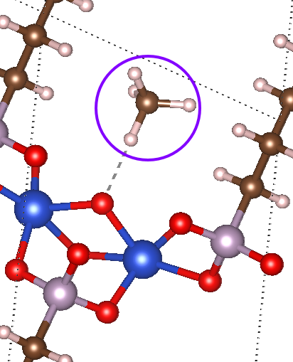

# MOF Adsorbate Initializer (MAI)
Python code to initialize the position of adsorbates on MOFs for high-throughput DFT screening

Setup
-----
1. MAI requires Python 3.x. If you do not already have Python installed, the easiest option is to download the [Anaconda](https://www.anaconda.com/download/) distribution.
2. Install the most recent versions of Pymatgen and ASE. This can be easily done using `pip install pymatgen ase` 
3. Download or clone the MAI repository and run `pip install .` from the MAI base directory.
4. (recommended) To detect open metal sites (OMSs), download and install [Zeo++](http://www.zeoplusplus.org/download.html) (any version >= 0.3). By default, Zeo++'s OMS detection algorithm does not output a lot of information necessary to add adsorbates to OMSs. To address this, copy `network.cc` from `network/network.cc` in the MAI directory and replace the corresponding `network.cc` file in the base directory of Zeo++. The relevant changes can be found starting on line 1165.
5. (recommended) To generate energy grids for the adsorption of molecular adsorbates (**`Todo`**)

Ready-to-Run Examples
-----
The main use of MAI is to add a single-atom adsorbate or a molecular adsorbate to a given adsorption site on a MOF. Sample scripts are provided in `/examples` that can be used to: 1) add a CH4 adsorbate to an O adsorption site using a RASPA-generated energy grid (`add_CH4.py`); 2) add an O adsorbate to an OMS using Zeo++'s OMS detection algorithm (`add_O.py`); 3) add an H adsorbate to an O adsorption site using one of Pymatgen's nearest neighbor algorithms (`add_H.py`).

adsorbate_constructor
-----
The main tool to initialize adsorbate positions is the `adsorbate_constructor`, as described below:
```python
class adsorbate_constructor():
	"""
	This class constructs an ASE atoms object with an adsorbate
	"""
	def __init__(self,ads_species,bond_dist,site_species=None,site_idx=None,
		r_cut=2.5,sum_tol=0.5,rmse_tol=0.25,overlap_tol=0.75):
		"""
		Initialized variables

		Args:
			ads_species (string): string of atomic element for adsorbate (e.g. 'O')
			bond_dist (float): distance between adsorbate and surface atom. If
			used with get_adsorbate_raspa, it represents the maximum distance
			for the adsorbate from the surface atom
			site_species (string): string of atomic element for the adsorption
			site species
			site_idx (int): ASE index for the adsorption site (defaults to
			the last element of element type site_species)
			r_cut (float): cutoff distance for calculating nearby atoms when
			ranking adsorption sites
			sum_tol (float): threshold to determine planarity. when the sum
			of the Euclidean distance vectors of coordinating atoms is less
			than sum_tol, planarity is assumed
			rmse_tol (float): second threshold to determine planarity. when the 
			root mean square error of the best-fit plane is less than rmse_tol,
			planarity is assumed
			overlap_tol (float): distance below which atoms are assumed to be
			overlapping
		"""
```
The only required arguments are `ads_species`, `bond_dist`, and either `site_species` or `site_idx`. Once the `adsorbate_constructor` is instanced, one of three routines can be called: `get_adsorbate_raspa`, `get_adsorbate_pm`, and `get_adsorbate_zeo_oms`. These are described below.

Molecular Adsorbate (RASPA)
-----



The `get_adsorbate_raspa` function is used to add a molecular adsorbate to the adsorption site of a MOF based on a molecular mechanics energy grid generated by the molecular simulation program RASPA, and the molecular adsorbate is initialized in the lowest energy position within some cutoff distance from the proposed adsorption site. It currently only supports CH4 adsorption but can be readily extended to support other molecular adsorbates. The `get_adsorbate_raspa` function is described below:

```python
def get_adsorbate_raspa(self,atoms_filepath,grid_path=None,
	write_file=True,new_mofs_path=None,error_path=None):
	"""
	This function adds a molecular adsorbate based on an energy grid
	generated using RASPA

	Args:
		atoms_filepath (string): filepath to the structure file (accepts
		CIFs, POSCARs, and CONTCARs)
		grid_path (string): path to the directory containing RASPA energy
		grids (defaults to 
		write_file (bool): if True, the new ASE atoms object should be
		written to a CIF file (defaults to True)
		new_mofs_path (string): path to store the new CIF files if
		write_file is True (defaults to /new_mofs within the
		directory of the starting structure files)
		error_path (string): path to store any adsorbates flagged as
		problematic (defaults to /errors within the directory of the
		starting structure files)
	Returns:
		new_atoms (Atoms object): ASE Atoms object of MOF with adsorbate
		new_name (string): name of MOF with adsorbate
	"""
```
The script below is taken from `examples/add_CH4.py`. It reads in CIF files from `mof_path`, adds CH4 within 3.0 Å of the last O atom in the CIF file (ensuring none of the atoms in CH4 overlap within 1.3 Å of the MOF), and stores the new CIF files with CH4 adsorbate in `new_mofs_path`. It assumes that the RASPA-generated energy grids are located in a folder named `examples/oxygenated_MOFs/energy_grids` since `grid_path` is not set in `get_adsorbate_raspa`. 

```python
import os
from mai.adsorbate_constructor import adsorbate_constructor

mof_path = 'examples/oxygenated_MOFs/'
new_mofs_path = 'examples/add_CH4/'
max_dist = 3.0
overlap_tol = 1.3
mol_species = 'CH4'
site_species = 'O'
for filename in os.listdir(mof_path):
	filepath = os.path.join(mof_path,filename)
	ads_const = adsorbate_constructor(mol_species,max_dist,
		site_species=site_species,overlap_tol=overlap_tol)
	mof_adsorbate, mof_name = ads_const.get_adsorbate_raspa(filepath,
		new_mofs_path=new_mofs_path)
```
Atomic Adsorbate (Zeo++)
-----


Atomic Adsorbate (Pymatgen)
-----

There are two implemented methods of initializing atomic adsorbates. The first allows for the use of one of Pymatgen's nearest neighbor algorithms to determine the coordination environment of the proposed adsorption site. The second allows for the use of 

```python
def get_adsorbate_pm(self,atoms_filepath,NN_method='vire',write_file=True,
	new_mofs_path=None,error_path=None):
	"""
	Use Pymatgen's nearest neighbors algorithms to add an adsorbate

	Args:
		atoms_filepath (string): filepath to the structure file (accepts
		CIFs, POSCARs, and CONTCARs)
		NN_method (string): string representing the desired Pymatgen
		nearest neighbor algorithm (accepts 'vire','voronoi','jmol',
		'min_dist','okeeffe','brunner', and 'econ')
		write_file (bool): if True, the new ASE atoms object should be
		written to a CIF file
		bond_dist (float): distance between adsorbate and surface atom
		new_mofs_path (string): path to store the new CIF files if
		write_file is True (defaults to atoms_filepath/new_mofs)
		error_path (string): path to store any adsorbates flagged as
		problematic (defaults to atoms_filepath/errors)
	Returns:
		new_atoms (Atoms object): Atoms object of MOF with adsorbate
		new_name (string): name of MOF with adsorbate
	"""
```

```python
import os
from mai.adsorbate_constructor import adsorbate_constructor

mof_path = 'examples/oxygenated_MOFs/'
new_mofs_path = 'examples/add_H/'
site_species = 'O'
ads_species = 'H'
bond_length = 1.0
NN_method = 'vire'

for filename in os.listdir(mof_path):
	filepath = os.path.join(mof_path,filename)
	ads_const = adsorbate_constructor(ads_species,bond_length,
		site_species=site_species)
	mof_adsorbate, mof_name = ads_const.get_adsorbate_pm(filepath,NN_method,
		new_mofs_path=new_mofs_path)
```
Running RASPA for Generating Energy Grids
-----
`Todo`

Running Zeo++ for OMS Detection
-----
Zeo++ is the recommended method for detecting OMSs in combination with MAI. To use the Zeo++ OMS detection algorithm, one simply has to run `zeo_path -omsex filepath`, where `zeo_path` is the path to `.../zeo++-0.3/network`, `-omsex` requests OMS detection with extended output, and `filepath` is the path to the CIF file of the MOF. This will produce a `.oms` and `.omsex` file for each MOF, which must be stored if MAI is to be used to add adsorbates to the OMSs.
