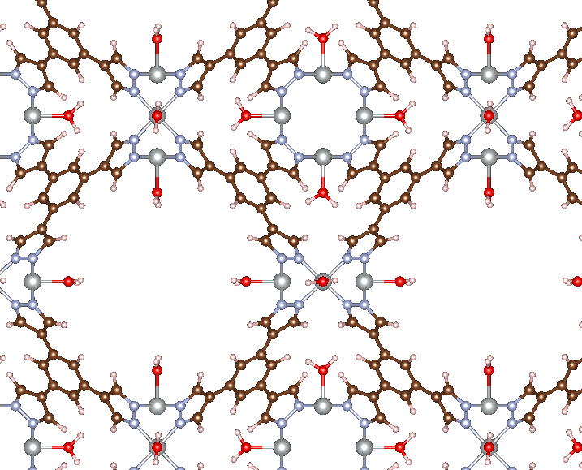

Advanced Skills
================
The previous tutorials should get you up and running so you can automate the construction of adsorbate geometries for a wide range of MOFs. However, for more advanced users, there are some additional features that may be of use. Let's walk through some more complex examples.

--------------------------
Adding Multiple Adsorbates
--------------------------
Instead of adding a single adsorbate, you may want to add an adsorbate to every metal site in a given MOF. We will consider the :download:`Ni-BTP <../examples/example_MOFs/Ni-BTP.cif>` MOF from the diatomic tutorial, except this time we will add an H2O molecule to every Ni site. This can be done using the code below.

.. literalinclude:: ../examples/add_all_H2O.py

There are a few changes we've made to the usual workflow. The first is that we needed to identify all of the possible adsorption site indices, which we have defined as ``Ni_idx``. This can be done using ASE's built-in tools for working with ASE ``Atoms`` ojbects. We then iterate over each site and add an H2O molecule. Since MAI adds adsorbates sequentially, we don't want to write out all the intermediate structures, so we also set ``write_file=False`` in :func:`~mai.adsorbate_constructor.adsorbate_constructor.get_adsorbate`. The last new aspect to introduce is that, instead of passing a CIF file via ``atoms_path`` in :func:`~mai.adsorbate_constructor.adsorbate_constructor.get_adsorbate`, we can directly pass in an ASE ``Atoms`` object via the ``atoms`` keyword argument. This is useful when you make modifications to the same MOF in a loop, as done here. The result of running this code is shown below.

|all_H2O|

--------------------
Neighbor Algorithms
--------------------
When specifying ``site_idx``, the :func:`~mai.adsorbate_constructor.adsorbate_constructor.get_adsorbate` function will automatically use Pymatgen's built-in nearest neighbor algorithms to determine the atoms in the first coordination sphere of the adsorption site. By default, MAI uses Pymatgen's ``crystal`` algorithm, but additional algorithms are available as listed in :func:`~mai.NN_algos.get_NNs_pm` and described here_. Through iterative testing, we have found ``crystal`` to be the best-performing algorithm for MOFs in general, but other algorithms can be considered if desired.

----------------------------
Pre-specification of Indices
----------------------------
In addition to the ``site_idx`` keyword in the :func:`~mai.adsorbate_constructor.adsorbate_constructor.get_adsorbate` function, it is also possible to manually specify the indices of the atoms in the first coordination sphere via the ``NN_indices`` keyword argument. This flexibility makes it possible to use a wide range of workflows in determining the desired adsorption site and coordinating atoms.

.. _here: http://pymatgen.org/_modules/pymatgen/analysis/local_env.html

