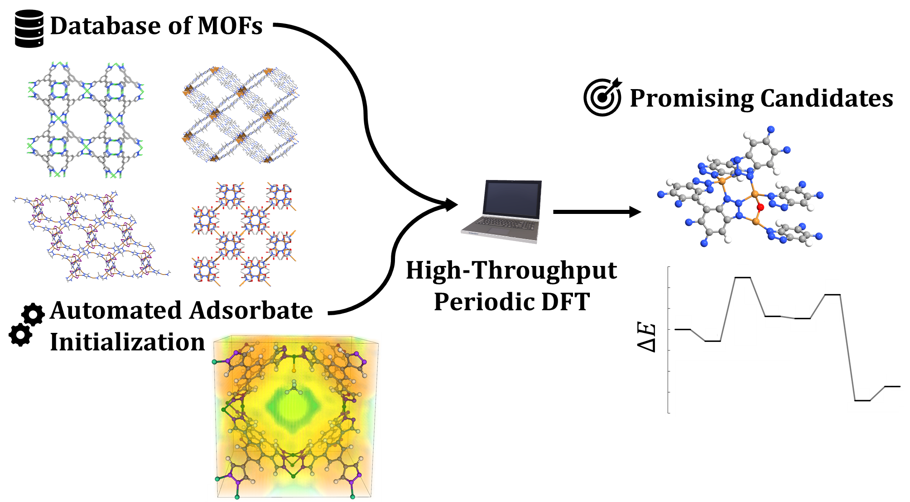

===============================
MOF Adsorbate Initializer
===============================

The MOF Adsorbate Initializer (MAI) is a set of Python tools to initialize the positions of small molecule adsorbates at coordinatively unsaturated sites in metal-organic frameworks (MOFs) in a high-throughput, fully automated manner. The main benefit of MAI is the ability to systematically construct initial structures for large-scale density functional theory (DFT) calculations on many hundreds of materials. With a dataset of initial structures, workflow tools like PyMOFScreen_ or Atomate_ can be used to run the structural optimizations with your favorite optimzier of choice.

.. _PyMOFScreen: https://github.com/arosen93/mof_screen
.. _Atomate: https://github.com/hackingmaterials/atomate

|TOC| 

--------
Contents
--------
.. toctree::
   
   install
   tutorials
   citing
   source/mai

