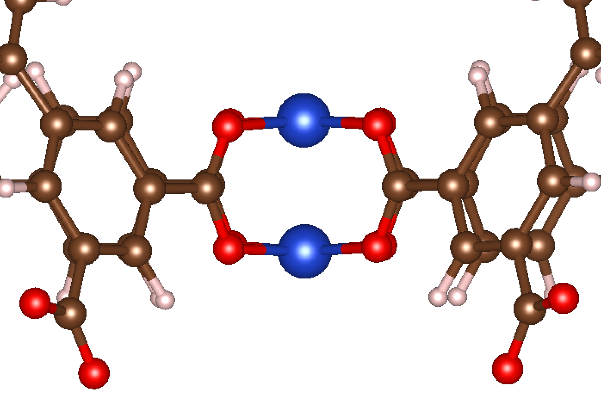

Monatomics
===========

In this example, we'll work through how to add a single atom adsorbate to open metal site in MOFs. The CIF for the MOF we'll use in this example can be found :download:`here <../examples/example_MOFs/Cu-BTC.cif>`. This MOF is known as Cu-BTC and has the structure shown below:

|Cu-BTC|

The metal (Cu) sites here are shown in orange. There are multiple Cu sites per unit cell, and each Cu site is in a paddlewheel-like structure. For this example, we will consider the initialization of an O atom adsorbate to a single coordinatively unsaturated Cu site. 

We'll start with the code that can do the job. Then we'll walk through what it all means.

.. literalinclude:: ../examples/add_O.py

Okay, let's dive right in! MAI requires the calling of an object known as the :class:`~mai.adsorbate_constructor.adsorbate_constructor`, which tells MAI what kind of adsorbate you'd like to make. For simple monatomic species, there are only a few arguments you need to worry about. 

1. The ``ads`` keyword argument is a string of the element that you want to add to the structure.
2. The ``d_MX1`` keyword argument is the desired distance between the adsorption site (i.e. the Cu species) and the adsorbate (in Å).

That takes care of initializing the :class:`~mai.adsorbate_constructor.adsorbate_constructor` object. Now we can use this object to call a function to initialize the adsorbate. This is done via :func:`~mai.adsorbate_constructor.adsorbate_constructor.get_adsorbate`. The output of calling :func:`~mai.adsorbate_constructor.adsorbate_constructor.get_adsorbate` is a new ASE ``Atoms`` object with the adsorbate initialized. The commonly used keywords for monatomic speies are as follows:

1. The ``atoms_path`` keyword argument is the filepath to the starting CIF file of the MOF.
2. The ``site_idx`` keyword argument is an integer representing the ASE ``Atoms`` index of the adsorption site (i.e. the Cu species). Later in this guide we'll show how this parameter can be determined automatically, but for now we have manually set it to the 0-th ``Atoms`` index via ``site_idx=0``, which corresponds to one of the Cu atoms. To find out the ASE indices for a given structure, you can inspect_ or visualize_ the ``Atoms`` object associated with the CIF file. Generally, it is the same indexing order as you'd find in your favorite CIF viewer (e.g. VESTA_).

Now let's see what happens as a result of running this code! The initialized structure is shown below:

|Cu-BTC-O|

Exactly what we'd expect! Generally, MAI aims to satisfy two major conditions. The first condition is that it tries to maximize the symmetry of the first coordination sphere when the adsorbate is added. In this case, the geometry is square planar prior to adsorption, so MAI makes a square pyramidal structure when the monatomic species is added. The second condition is that MAI tries to minimize steric interactions when possible. In the case of a paddlewheel structure like Cu-BTC, the monatomic adsorbate could have been initialize in one of two directions normal to the square planar first coordination sphere. However, only one of those directions is geometrically accessible (the other is pointed inward between the Cu paddlewheel, which would not be reasonable).

That concludes our tutorial with monatomic adsorbates. Join me as we move onto more complicated systems! Up next is diatomics!

.. |Cu-BTC-O| image:: _static/cubtc2.png
   :align: middle
   :scale: 25 %
.. _inspect: https://wiki.fysik.dtu.dk/ase/ase/atoms.html
.. _visualize: https://wiki.fysik.dtu.dk/ase/ase/visualize/visualize.html
.. _VESTA: https://jp-minerals.org/vesta/en/