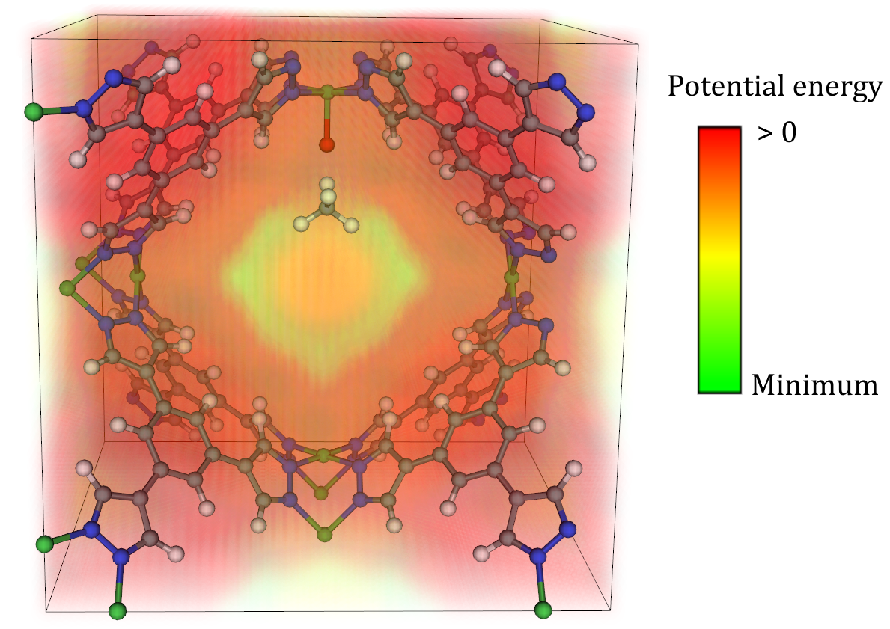

Potential Energy Grids
======================
Some adsorbates do not lend themselves well to the geometric approaches laid out thus far. This is particularly the case for adsorbates that are physisorbed relatively far away from an adsorption site, as opposed to chemisorbed nearby. In these cases, an alternative way of initializing the adsorbate can be considered by mapping a out a potential energy grid (PEG) of each MOF and putting the adsorbate in a low-energy site within some cutoff radius of the proposed adsorption site. A visualized example of such a grid is shown below.

|grid|

MAI supports two different formats for PEGs. The first is the cube_ file format for grids, such as those generated from `PorousMaterials.jl <https://github.com/SimonEnsemble/PorousMaterials.jl>`_. Details of how to generate such PEGs can be found `here` <https://simonensemble.github.io/PorousMaterials.jl/latest/#>`_. The second accepted format is a space-delimited file with four columns of (x,y,z,E) entries, where E is the potential energy and (x,y,z) are the coordinates. Each new line represents a new (x,y,z,E) vector. This is the file-format produced from RASPA_-generated PEGs. Such a file might look like the following

``0 0 0 -100``

``0 0 0.1 -110``

``0 0 0.2 -120``

``...``

Currently, only single-site CH4 adsorbates are supported with PEGs, although in principle it would be trivial to consider other adsorbates as well. When use PEGs to initialize the position of CH4 adsorbates, the C atom of the CH4 molecule will be placed in the low-energy site, and the four remaining H atoms will be arranged to form the tetrahedral structure of CH4, with one of the H atoms pointed directly toward the adsorption site.

Unlike with the monatomics, diatomics, and triatomics tutorials, when dealing with PEGs, one must use the :func:`~mai.adsorbate_constructor.adsorbate_constructor.get_adsorbate_grid` function instead of :func:`~mai.adsorbate_constructor.adsorbate_constructor.get_adsorbate`. The :func:`~mai.adsorbate_constructor.adsorbate_constructor.get_adsorbate_grid` function is quite simple and only requires two main arguments. The first is the filepath to the MOF CIF, and the second is the ``grid_format`` keyword argument, which must be either ``ASCII`` for a RASPA-style grid or ``cube`` for a `PorousMaterials.jl <https://github.com/SimonEnsemble/PorousMaterials.jl>`_-style grid. An example code is shown below.

.. literalinclude:: _static/grid.py

The result of running this code is the following structure.

.. _RASPA: https://www.tandfonline.com/doi/full/10.1080/08927022.2015.1010082
.. _cube: http://paulbourke.net/dataformats/cube/

