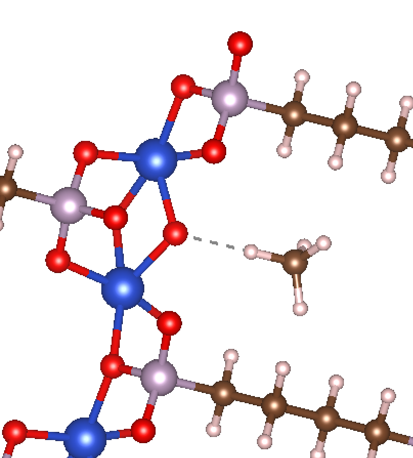

Potential Energy Grids
======================
Some adsorbates do not lend themselves well to the geometric approaches laid out thus far. This is particularly the case for adsorbates that are physisorbed relatively far away from an adsorption site, as opposed to chemisorbed nearby. In these cases, an alternative way of initializing the adsorbate can be considered by mapping out a potential energy grid (PEG) of each MOF and putting the adsorbate in a low-energy site within some cutoff radius of the proposed adsorption site. A visualized example of such a PEG is shown below for a methane adsorbate near a proposed Ni-O active site.

|grid|

MAI supports two different formats for PEGs. The first is the cube_ file format, such as that generated from `PorousMaterials.jl <https://github.com/SimonEnsemble/PorousMaterials.jl>`_. Details of how to generate such PEGs can be found `here <https://simonensemble.github.io/PorousMaterials.jl/latest/#>`_. The second accepted format is a space-delimited file with four columns of (x,y,z,E) entries, where E is the potential energy and (x,y,z) are the coordinates. Each new line represents a new (x,y,z,E) vector. We'll refer to this file as an ASCII grid.

Currently, only single-site CH4 adsorbates are supported with PEGs, although in principle it is trivial to consider other adsorbates as well. When using PEGs to initialize the position of CH4 adsorbates, the C atom of the CH4 molecule will be placed in the low-energy site, and the four remaining H atoms will be arranged to form the tetrahedral structure of CH4, with one of the H atoms pointed directly toward the adsorption site.

Unlike with the monatomics, diatomics, and triatomics tutorials, when dealing with PEGs, one must use the :func:`~mai.adsorbate_constructor.adsorbate_constructor.get_adsorbate_grid` function instead of :func:`~mai.adsorbate_constructor.adsorbate_constructor.get_adsorbate`. The :func:`~mai.adsorbate_constructor.adsorbate_constructor.get_adsorbate_grid` function is quite simple. An example code is shown below to initialize an adsorbate based on an :download:`example PEG <../examples/example_MOFs/energy_grids_ASCII/AHOKIR01-O.grid>` and :download:`example MOF <../examples/example_MOFs/energy_grids_ASCII/AHOKIR01-O.cif>`.

.. literalinclude:: ../examples/add_CH4_PEG.py

The arguments for are described below:

1. The ``atoms_path`` and ``site_idx`` are the same as for :func:`~mai.adsorbate_constructor.adsorbate_constructor.get_adsorbate`.
2. The ``grid_path`` keyword argument is the path to the PEG file.
3. The ``grid_format`` keyword argument can be either ``grid_format='cube'`` or ``grid_format='ASCII'``.

The result of running the previous example code is the following structure.

|grid|

.. _RASPA: https://www.tandfonline.com/doi/full/10.1080/08927022.2015.1010082
.. _cube: http://paulbourke.net/dataformats/cube/

